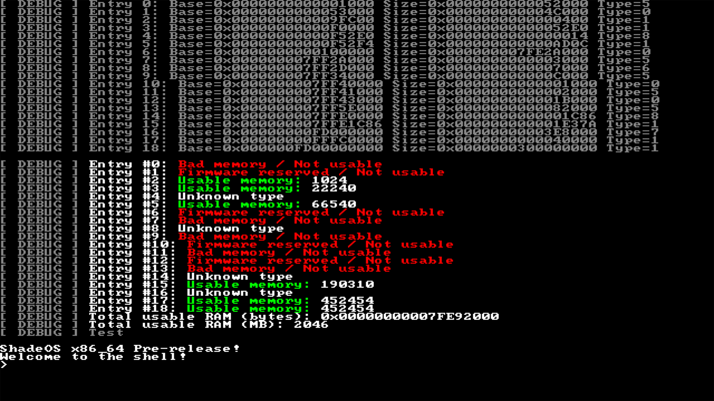

# ShadeOS

not much to see as even the readme is under construction

## Screenshot
------------------------------------------


## Feature Plans
- [x] Bootloader Limine - thick  
- [x] GDT, IDT - thick  
- [x] TSC - thick  
- [x] Basic drivers - thick  
- [x] Panic screen - thick  
- [ ] Scheduler - not thick  
- [ ] Syscall - not thick  
- [ ] User space / kernel space - not thick  
- [ ] HESP (the timer) - not thick  
- [ ] ACPI - not thick  
- [ ] GUI - not thick  

*continues…*

## Build
-----------------------------
To build the kernel:  
```bash
make
````

To build and run in QEMU:

```bash
make run
```

To build and debug:

```bash
make debug
```

To clean build files:

```bash
make clean
```

## License

Licensed under **GPL 3.0**
